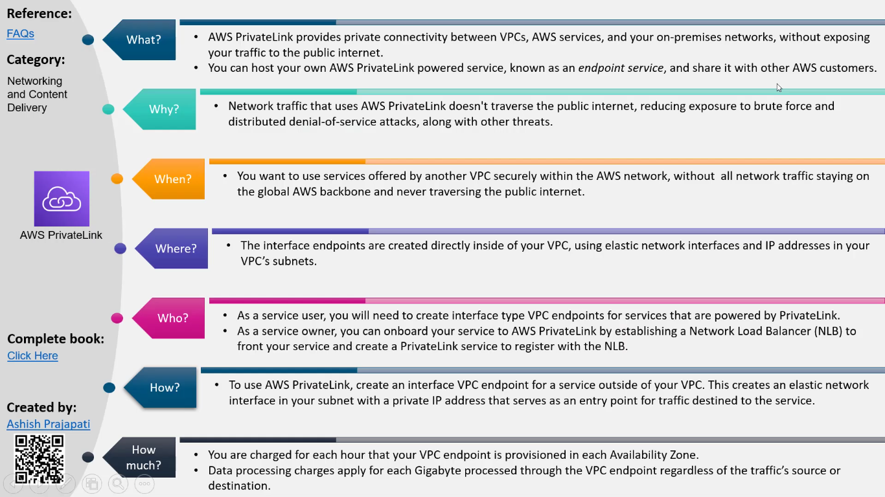

# Networking
### [A conversation on AWS networking](https://explore.skillbuilder.aws/learn/course/12439/play/81847/aws-networking-basics;lp=1944)

# [AWS re:Invent 2023 Networking & Content Delivery](https://www.youtube.com/playlist?list=PL2yQDdvlhXf-z265uBFVcvoAG-OXy7530)

### [AWS re:Invent 2023 - AWS networking foundations (NTA307)](https://www.youtube.com/watch?v=8nNurTFy-h4)

### [AWS re:Invent 2023 - Advanced VPC designs and new capabilities (NET306)](https://www.youtube.com/watch?v=cRdDCkbE4es)

AWS Private Link/Endpoint Services
