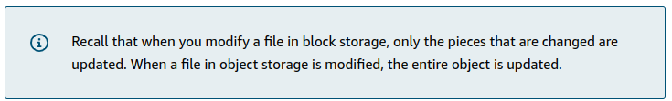
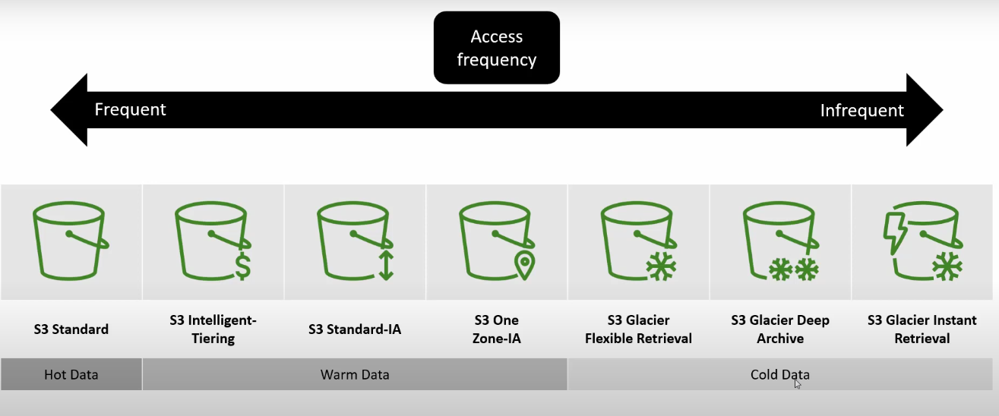
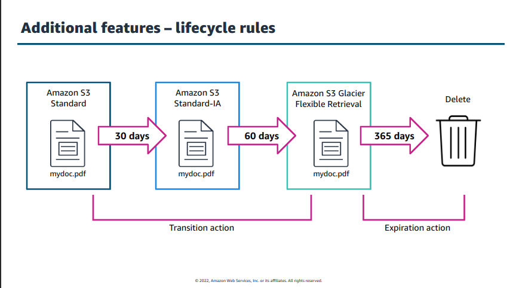
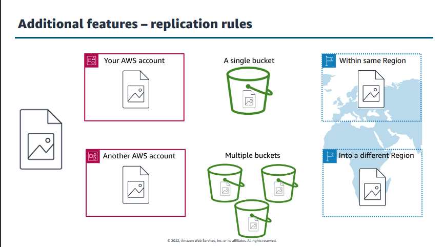
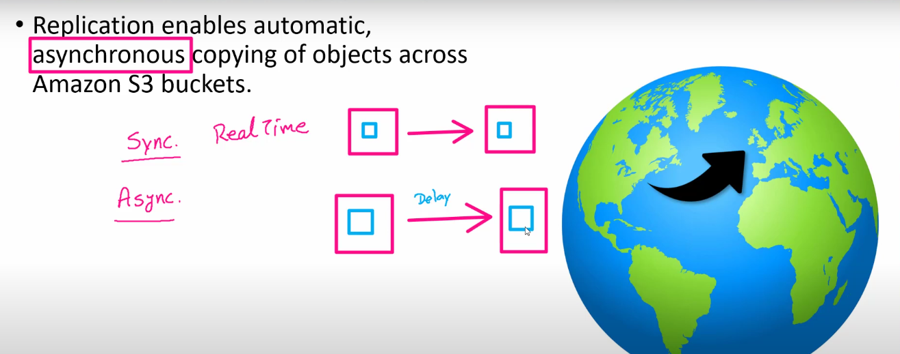
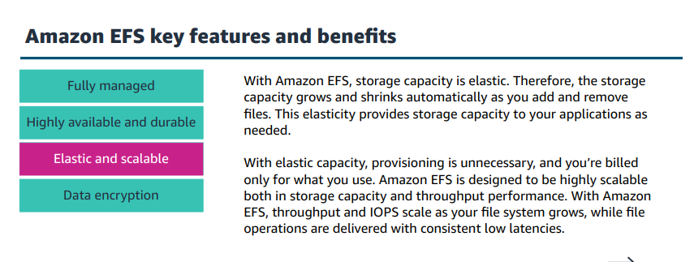
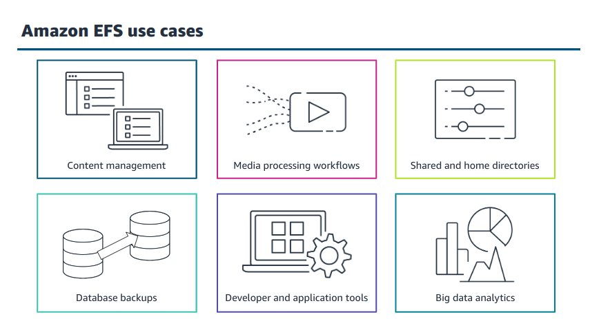

Core AWS Storage (web)

    Amazon Elastic Block Store (Amazon EBS) 
    Amazon Elastic File System (Amazon EFS)
    Amazon FSx for Windows File Server
    Amazon FSx for Lustre
    Amazon Simple Storage Service (Amazon S3)
    Amazon S3 Glacier and S3 Glacier Deep Archive
    

# S3

    In object storage, each object consists of data, metadata, and a key.

    The data might be an image, video, text document, or any other type of file. Metadata contains information about what the data is, how it is used, the object size, and so on. An object’s key is its unique identifier.

# S3 Life Cycle Policies

# S3 Replication 

# Transfer Acceleration

# [Shared Responsibility Model](https://aws.amazon.com/compliance/shared-responsibility-model/)

# Elastic Block Storage

    An EBS snapshot is an incremental backup. This means that the first backup taken of a volume copies all the data. For subsequent backups, only the blocks of data that have changed since the most recent snapshot are saved. 

    Incremental backups are different from full backups, in which all the data in a storage volume copies each time a backup occurs. The full backup includes data that has not changed since the most recent backup.

# Elastic File Storage

# Amazon S3 Glacier

